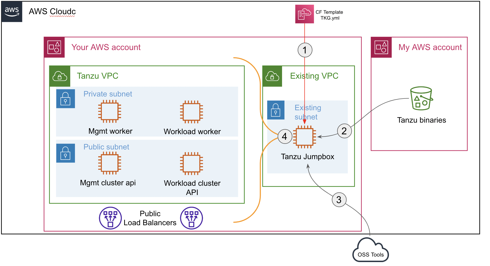

## This projects deploy Tanzu cluster in your AWS Account

## Deployment steps

First authenticate to aws console.   
Then click on Launch stack button. 
You'll be redirected to a cloudformation Form to select your infra details. 
Choose the region you want to operate in prior to fill the form. The only prerequisite is to have a valid EC2 keypair and a working VPC/subnet with internet access in this region. Default VPC is ok to be used.
The project will automatically:  
1. Deploy a dedicated jumpbox
2. Download tanzu binaries from my staging bucket
3. Download Open source tools for configuration
4. Deploy a new VPC with a Tanzu managemnt Cluster and a Tanzu workload cluster inside it.   

