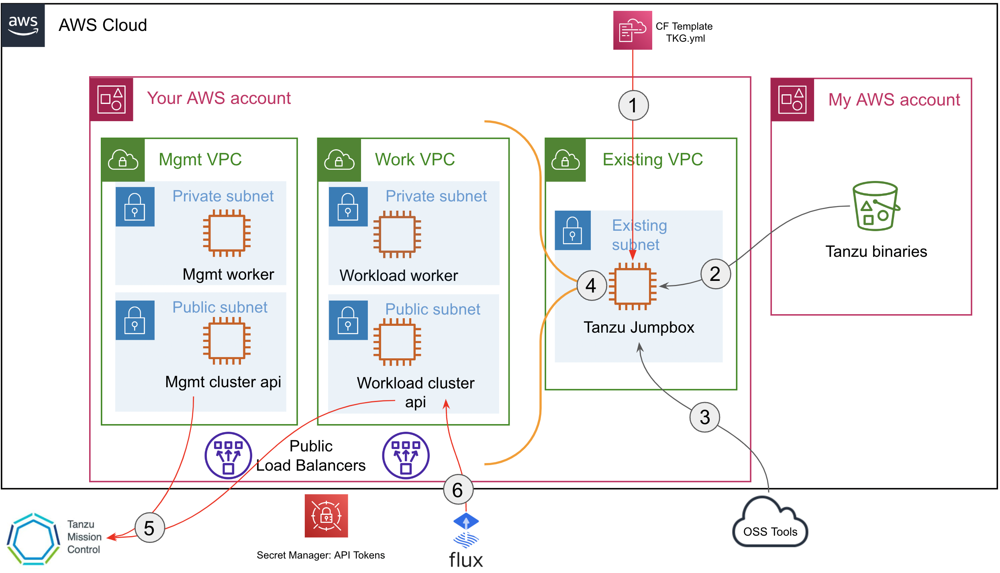

#Deployment steps
First authenticate to aws console. Then click on Launch stack button, you'll be redirected to a cloudformation Form to select your infra details.
CHoose the region you wnat to operate in prior to fill the form. The only prerequisite is to have an EC2 keypair and a wokring VPC/subnet with internet access in this region. Default VPC is ok to be used.
The project will
1. Deploy a dedicated jumpbox
2. Download tanzu binaries from my staging bucket
3. Download Open source tools for configuration
4. Deploy a new VPC with a Tanzu managemnt Cluster and a Tanzu workload cluster inside